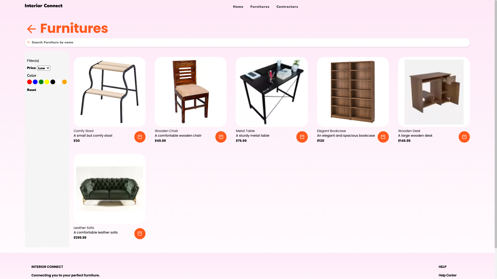

# Interior Connect Client


## Installation Steps

To set up the project on your local machine, follow these steps:

1.  Clone the repository:
    
    ```
    git clone https://github.com/ViscousGuy/interior-connect-client.git
    
    ```
    
2.  Navigate to the project directory:
    
    ```
    cd interior-connect-client
    
    ```
    
3.  Install the dependencies:
    
    ```
    npm install
    
    ```
    
4.  Start the development server:
    
    ```
    npm run dev
    
    ```
    

## Features

-   **Contractor Search**: Implemented search functionality on the contractor page to help users find the right professional for their project.
-   **Furniture Search**: Added search functionality on the furniture page, allowing users to filter through a wide range of furniture options.
-   **Responsive Design**: Ensures a seamless experience across various devices and screen sizes.
-   **Upcoming**: Integration of advanced filters to refine search results further.

## Technology Stack

-   **React**: For dynamic and interactive elements.
-   **SCSS**: For modern and maintainable stylesheets.
-   **Vite**: As the build tool for a faster and leaner development experience.

## Application Routes

### Home Page


### Furniture Page


### Furniture Detail Page


### Contractor Page


### Contractor Detail Page


### Not Found Page


## License

This project is licensed under the MIT License - see the [LICENSE](https://github.com/ViscousGuy/interior-connect-client/blob/main/LICENSE) file for details.